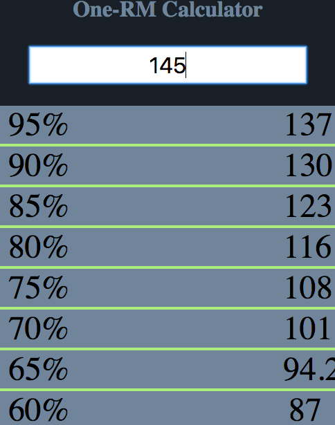

## 1 REP MAX CALC

* Easy way to calculate lifting percentages:


# Demo Screenshot:



```js
npm install
npm start
```

* Made for Crossfitters!


This project was bootstrapped with [Create React Native App](https://github.com/react-community/create-react-native-app).